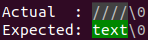
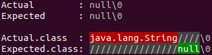
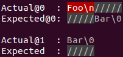
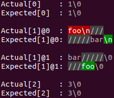

A colored diff looks like this:


## Basic Rules for Interpreting Diff

* Red characters need to be deleted from `Actual`.
* Uncolored characters are equal in `Actual` and `Expected`.
* Green characters need to be inserted into `Actual`.
* Characters in the opposite direction of insertions and deletions are padded with `/` characters to line up the strings vertically. This padding does not contribute any characters to the string it is found in. Read on for concrete examples.


## Example 1: insert

```text
Actual   = ""
Expected = "text"
```

results in the following diff:



Meaning, to go from `Actual` to `Expected` we need to insert "text".

## Example 2: delete

```text
Actual   = "text"
Expected = ""
```

results in the following diff:


Meaning, to go from `Actual` to `Expected` we need to delete "text".

## Example 3: padding

```text
Actual   = "foo"
Expected = "   foo"
```

results in the following diff:


Meaning:

* To go from `Actual` to `Expected` we need to insert three spaces at the beginning of `Actual`.
* There are no `///` characters in `Expected` in front of "foo". This padding is used to line up the strings vertically.

## Example 4: delete, keep, insert

```text
Actual   = "foosball"
Expected = "ballroom"
```

results in the following diff:


Meaning, we need to:

* Delete "foos".
* Keep "ball".
* Insert "room".
* There is no whitespace before "ballroom" or after "foosball". This padding is used to line up the strings vertically.

## Example 5: Objects with the same toString() that are not equal

* If objects are not equal, and their `toString()` values differ, we output their String representations.
* If the `toString()` values are equal, but their types differ, we output the string representation of `Actual` followed by the two types (i.e. `Actual.class` vs `Expected.class`).
* If their classes are equal, but their `hashCode()` values differ, we output the string representation of `Actual` followed by the two hashcodes (i.e. `Actual.hashCode()` vs `Expected.hashCode()`).

For example:

```text
Actual   = "null"
Expected = null
```

results in the following diff:



## Example 6: Multi-line Strings

When comparing multi-line strings:

* `Actual` and `Expected` are followed by a line number.
* Lines that are identical (with the exception of the first and last line) are omitted.

For example:

```text
Actual   = "first\nsecond\nfoo\nforth\nfifth"
Expected = "first\nsecond\nbar\nforth\nfifth"
```

results in the following diff:


Meaning:

* Lines 1-2 were equal.
* On line 3, we need to delete "foo" and insert "bar".
* Lines 4-5 were equal.

Lines always end with `\n` or `\0`. The former denotes a newline. The latter denotes the end of the string.

Lines ending with "\n\n" or "\0\0" represents the literal string "\n" followed by a newline character, or the literal string "\0" followed by the end of string, respectively.

## Example 7: Missing Line Numbers

When `Actual` or `Expected` contain a line that does not have a corresponding line on the other side we omit the latter's line number.

```text
Actual   = "Foo\nBar"
Expected = "Bar"
```

results in the following diff:



Meaning:

* `Actual` contained more lines than `Expected`.
* `Expected` did not have a line that corresponded to `Actual` line 1.
* We need to delete line 1 and retain line 2 unchanged.

## Example 8: Lists and Arrays

When comparing lists or arrays:

* `Actual` and `Expected` are followed by the element's index number, followed by a line number.
* Indexes that are identical (with the exception of the first and last line) are omitted.

For example:

```java
Actual   = List.of("1", "foo\nbar", "3");
Expected = List.of("1", "bar\nfoo", "3");
```

results in the following diff:



Meaning:

* Index 0 was equal.
* On index 1 line 0, we need to delete "foo\n".
* On index 1 line 1, we need to insert "\n" after "bar".
* On index 1 line 1, we need to insert "foo" before the end of string.
* Index 2 was equal.