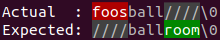

## Automatic message generation

Guava's API forces you to repeat yourself. This API generates concise messages on your behalf.

Guava:

```java
String name = "John Smith";
Preconditions.checkArgument(name.length() <= 5, "name must be shorter than 6 characters");
```

Output:

```
java.lang.IllegalArgumentException: name must be shorter than 6 characters
  at com.google.common.base.Preconditions.checkArgument(Preconditions.java:146)
  at Main.guava(Main.java:45)
  at Main.main(Main.java:70)
```

This API:

```java
requireThat(name, "Name").length().isLessThanOrEqualTo(5);
```

Output:

```
java.lang.IllegalArgumentException: name may not contain more than 5 characters.
Name.length(): 7
Name         : John Smith
  at Main.requirements(Main.java:57)
  at Main.main(Main.java:72)
```

## Diffs provided whenever possible

Not only do we provide you with the actual and expected values, we also provide a diff whenever possible.

Guava:

```java
List<Integer> actual = Arrays.asList(2, 3, 4, 6);
List<Integer> expected = Arrays.asList(1, 3, 5);
Preconditions.checkArgument(actual.containsAll(expected), "actual must contain %s", expected);
```

Output:

```
java.lang.IllegalArgumentException: actual must contain [1, 3, 5]
  at com.google.common.base.Preconditions.checkArgument(Preconditions.java:146)
  at Main.guava(Main.java:95)
  at Main.run(Main.java:129)
  at Main.main(Main.java:137)
```

This API:

```
List<Integer> actual = Arrays.asList(2, 3, 4, 6);
List<Integer> expected = Arrays.asList(1, 3, 5);
requireThat(actual, "actual").containsAll(expected);
```

Output:

```
java.lang.IllegalArgumentException: actual must contain all elements in: [1, 3, 5]
Actual : [2, 3, 4, 6]
Missing: [1, 5]
  at Main.requirements(Main.java:106)
  at Main.run(Main.java:131)
  at Main.main(Main.java:137)
```

## Clean stack-traces

This API's classes do not show up in your stack-traces.

Guava:
```
java.lang.NullPointerException: Actual may not be null
  at com.google.common.base.Preconditions.checkNotNull(Preconditions.java:251)
  at Main.guava(Main.java:21)
  at Main.main(Main.java:65)
```

This API:

```
java.lang.NullPointerException: Actual may not be null
  at Main.requirements(Main.java:33)
  at Main.main(Main.java:67)
```

## Assertion support

This library is compatible with Java assertions.

If you need to run in a high performance, zero allocation environment (to reduce latency and jitter) look no
further than the following design pattern:

```java
import java.time.LocalDate;
import java.time.LocalDateTime;
import java.time.Month;

import static io.github.cowwoc.requirements12.java.DefaultJavaValidators.that;

public class Person
{
  public void eatLunch()
  {
    assert that("time", LocalDateTime.now().getHour()).isAfter("noon", 12).elseThrow();
  }
}
```

Per https://docs.oracle.com/javase/8/docs/technotes/guides/language/assert.html:

> Disabling assertions eliminates their performance penalty entirely.

## Multiple validation failures

```java
String name = "George";
String province = "Florida";
List<String> provinces = Arrays.asList("Ontario", "Quebec", "Nova Scotia", "New Brunswick", "Manitoba",
  "British Columbia", "Prince Edward Island", "Saskatchewan", "Alberta", "Newfoundland and Labrador");

List<ValidationFailure> failures = new ArrayList<>(checkIf(name, "name").length().isBetween(10, 30).elseGetFailures());
failures.addAll(checkIf(provinces, "provinces").contains(province).elseGetFailures());

for (ValidationFailure failure: failures)
  System.out.println(failure.getMessage());
```

Output will look like:

```
name must contain [10, 30) characters.

"provinces" must contain provide "province".
province: Florida
Actual: [Ontario, Quebec, Nova Scotia, New Brunswick, Manitoba, British Columbia, Prince Edward Island, Saskatchewan, Alberta, Newfoundland and Labrador]
```

## Nested validations

Nested validations facilitate checking multiple properties of a value. For example,

```java
Map<String, Integer> nameToAge = new HashMap<>();
nameToAge.put("Leah", 3);
nameToAge.put("Nathaniel", 1);

requireThat(nameToAge, "nameToAge").
keySet().containsAll(Arrays.asList("Leah", "Nathaniel"));

requireThat(nameToAge, "nameToAge").
values().containsAll(Arrays.asList(3, 1));
```

can be converted to:

```java
requireThat(nameToAge, "nameToAge").
  and(v -> v.keySet().containsAll(Arrays.asList("Leah", "Nathaniel"))).
  and(v -> v.values().containsAll(Arrays.asList(3, 1)));
```

## String diff

When
a [String comparison](https://cowwoc.github.io/requirements.java/12.0/io.github.cowwoc.requirements.java/com/github/cowwoc/requirements12/java/type/component/ObjectValidatorComponent#isEqualTo(java.lang.Object))
fails, the library outputs a diff of the values being compared.

Depending on the terminal capability, you will see a [textual](textual_diff.md) or a [colored](colored_diff.md) diff.



On Windows OS, this feature only works in Windows Terminal. On other platforms, it should work in any
terminal.

### Overriding Terminal Detection

The use of colors is disabled by default if stdin or stdout are redirected, even if ANSI colors are supported.
To enable colors,
invoke [GlobalConfiguration.terminalEncoding(TerminalEncoding)](https://cowwoc.github.io/requirements.java/12.0/io.github.cowwoc.requirements.java/com/github/cowwoc/requirements12/java/GlobalConfiguration.html#terminalEncoding(io.github.cowwoc.requirements12.java.TerminalEncoding)).

## Returning the value after validation

You can get the value after validating or transforming it, e.g.

```java
class Player
{
  private final String name;

  public Player(String name)
  {
    this.name = requireThat(name, "name").strip().isNotEmpty().getValue();
  }
}
```