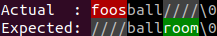

## Automatic message generation

Guava's API forces you to repeat yourself. This API generates concise messages on your behalf.

```java
String number = "1234567";

// Guava
Preconditions.checkArgument(number.length() <= 5, "number must be shorter than 6 characters");

java.lang.IllegalArgumentException: number must be shorter than 6 characters
	at com.google.common.base.Preconditions.checkArgument(Preconditions.java:146)
	at Main.guava2(Main.java:45)
	at Main.main(Main.java:70)

// This API
requireThat(number, "number").length().isLessThanOrEqualTo(5);

java.lang.IllegalArgumentException: number may not contain more than 5 characters.
Actual: 7
number: 1234567
	at Main.requirements2(Main.java:57)
	at Main.main(Main.java:72)
```

## Diffs provided whenever possible

Not only do we provide you with the actual and expected values, we also provide a diff whenever possible.

```java
List<Integer> actual = Arrays.asList(2, 3, 4, 6);
List<Integer> expected = Arrays.asList(1, 3, 5);

// Guava
Preconditions.checkArgument(actual.containsAll(expected), "actual must contain %s", expected);

java.lang.IllegalArgumentException: actual must contain [1, 3, 5]
	at com.google.common.base.Preconditions.checkArgument(Preconditions.java:146)
	at Main.guava3(Main.java:95)
	at Main.run(Main.java:129)
	at Main.main(Main.java:137)

// This API
requireThat(actual, "actual").containsAll(expected);

java.lang.IllegalArgumentException: actual must contain all elements in: [1, 3, 5]
Actual : [2, 3, 4, 6]
Missing: [1, 5]
	at Main.requirements3(Main.java:106)
	at Main.run(Main.java:131)
	at Main.main(Main.java:137)
```

## Clean stack-traces

This API's classes do not show up in your stack-traces.

```java

// Guava
java.lang.NullPointerException: actual may not be null
	at com.google.common.base.Preconditions.checkNotNull(Preconditions.java:251)
	at Main.guava1(Main.java:21)
	at Main.main(Main.java:65)

// This API
java.lang.NullPointerException: actual may not be null
	at Main.requirements1(Main.java:33)
	at Main.main(Main.java:67)
```

## Assertion support

All verifiers allocate memory which is especially hard to justify given that most checks are never going to fail. If you need to run in a high-performance, zero allocation environment (to reduce latency and jitter) look no further than `DefaultRequirements.assertThat()`.

`assertThat()` skips verification if assertions are disabled. `DefaultRequirements` might be less flexible than `Requirements` but it only allocates `Requirements` once per application. Together, they guarantee high performance and no allocations if assertions are disabled.

## Multiple validation errors

```java
String name = "George";
String province = "Florida";
List<String> provinces = Arrays.asList("Ontario", "Quebec", "Nova Scotia", "New Brunswick", "Manitoba",
			"British Columbia", "Prince Edward Island", "Saskatchewan", "Alberta", "Newfoundland and Labrador");

List<ValidationFailure> failures = new ArrayList<>();
failures.addAll(validateThat(name, "name").length().isBetween(10, 30).getFailures());
failures.addAll(validateThat(province, "province").isOneOf(provinces).getFailures());
for (ValidationFailure failure : failures)
	System.out.println(failure.getMessage());
```

Output will look like:

```
name must contain [10, 30) characters.
province must be one of [Ontario, Quebec, Nova Scotia, New Brunswick, Manitoba, British Columbia, Prince Edward Island, Saskatchewan, Alberta, Newfoundland and Labrador].
```

## Grouping nested requirements

Some classes provide a mechanism for grouping nested requirements. For example, `MapVerifier` has methods `keySet()` and `keySet(Consumer<CollectionVerifier>>)`, `values()` and `values(Consumer<CollectionVerifier>>`. This enables one to group requirements that share the same parent. For example:

```java

Map<String, Integer> nameToAge = new HashMap<>();
nameToAge.put("Leah", 3);
nameToAge.put("Nathaniel", 1);

requireThat(nameToAge, "nameToAge").isNotNull();
requireThat(nameToAge, "nameToAge").keySet().containsAll(Arrays.asList("Leah", "Nathaniel"));
requireThat(nameToAge, "nameToAge").values().containsAll(Arrays.asList(3, 1));
```

can be rewritten as:

```java

requireThat(nameToAge, "nameToAge").isNotNull().
  keySet(k -> k.containsAll(Arrays.asList("Leah", "Nathaniel"))).
  values(v -> v.containsAll(Arrays.asList(3, 1)));
```

## String diff

When a [String comparison](https://cowwoc.github.io/requirements.java/6.0.2/docs/api/com.github.cowwoc.requirements.java/com/github/cowwoc/requirements/java/extension/ExtensibleObjectVerifier.html#isEqualTo(java.lang.Object)) fails, the library outputs a [diff](String_Diff.md) of the values being compared.



On some platforms, this feature can only be unlocked by [deploying native libraries](Deploying_Native_Libraries.md).

## Getting the actual value

Sometimes it is convenient to retrieve the actual value after a verification/validation:

```java
class Player
{
    private final String name;

    public Player(String name)
    {
        this.name = requireThat(name, "name").isNotEmpty().getActual();
    }
}
```
